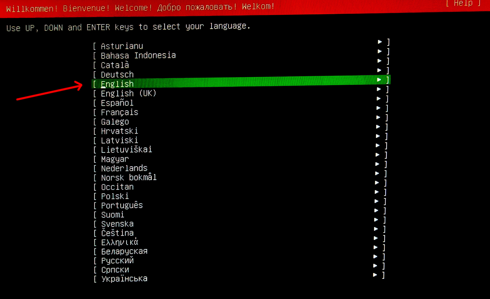
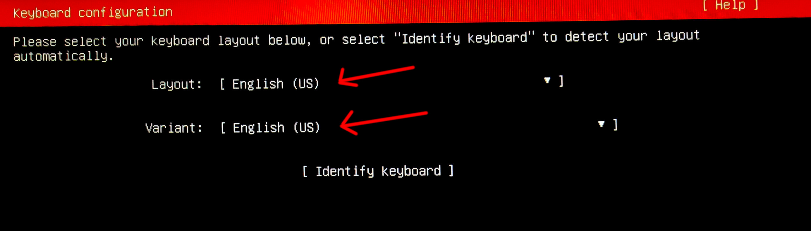
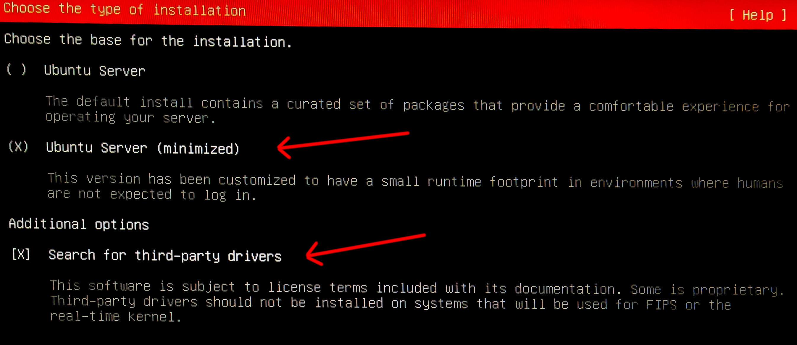
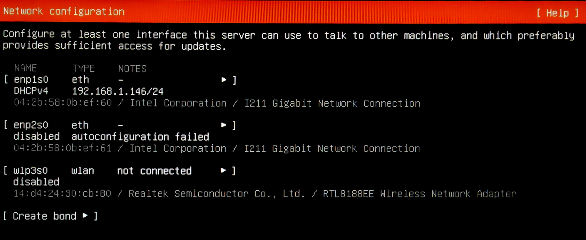
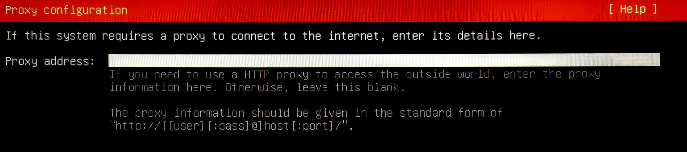

# Ubuntu 24.04 LTS installation with ISO

1. Select `English` as language.

   

2. Select `English (US)` as the keyboard layout and variant.

   

3. Select `Ubuntu Server (minimized)` as the base for the installation and search for third-party drivers (if available). Select `Install OpenSSH server` when prompted.

   

4. Unselect `Set up this disk as an LVM group` and make sure the option `Use an entire disk` is selected.

   

5. No action needed. Proceed with the installation.

   

6. When the installation is finished, remove the installation media and reboot the device.
