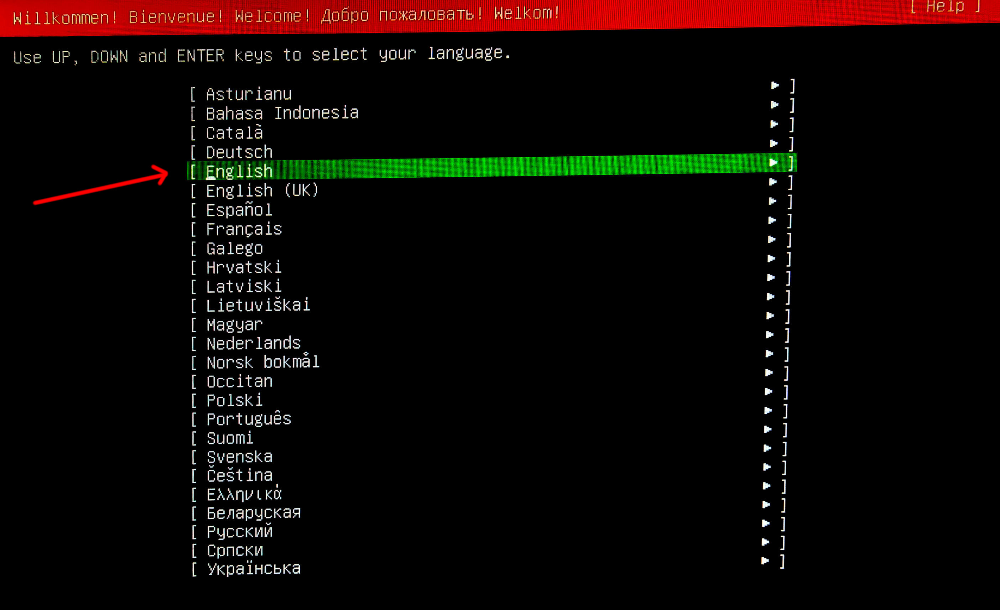
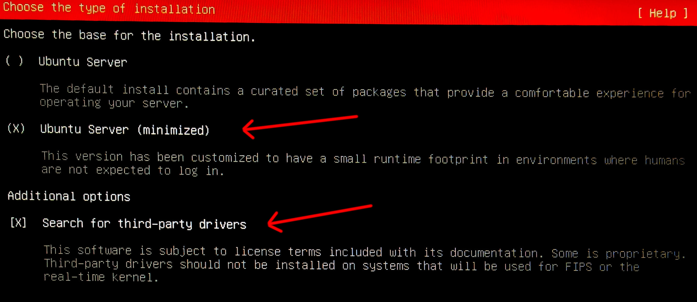
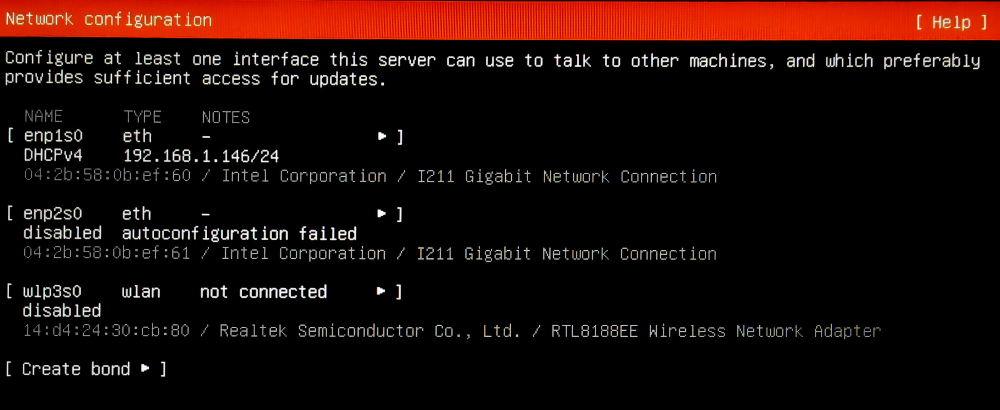
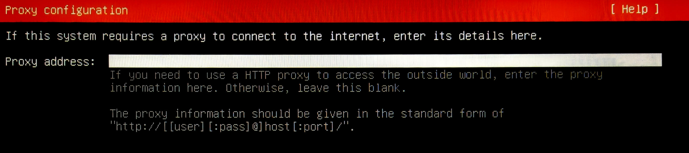

<header>
  
    
    <h1>COOLBLOCK - Ubuntu 24.04.2 LTS installation with ISO</h1>
  
</header>

1. Select `English` as language and proceed.

   

2. Select `English (US)` as the keyboard layout and variant, proceed with the installation.

   

3. Select `Ubuntu Server (minimized)` as the base for the installation and search for third-party drivers (_if available_). Proceed.

   

4. Let network auto configure itself with **DHCP**. _It will be changed afterwards via the Coolblock Panel install script_. Proceed.

   

5. Proceed **without** adding any HTTP proxy.

   

6. Proceed with the **default** APT mirror.

   

7. Unselect `Set up this disk as an LVM group` and make sure the option `Use an entire disk` is selected.

   

8. **No action needed**. Proceed with the installation.

   

9. Create the default user `coolblock` and set the hostname to `panel`. Set the password to `coolblock`, _it will be changed afterwards by the end customer._ Proceed.

   

10. **Skip** `Ubuntu Pro` and proceed.

    

11. Select `Install OpenSSH server` and proceed.

    

12. **Do not** select any additional `snap` packages. Proceed normally.

    

13. When the installation is finished, reboot the device.

    
