<header>
  
    
    <h1>COOLBLOCK - OS Installation - Ubuntu 24.04 LTS</h1>
  
</header>

1. Select `English` as language.

   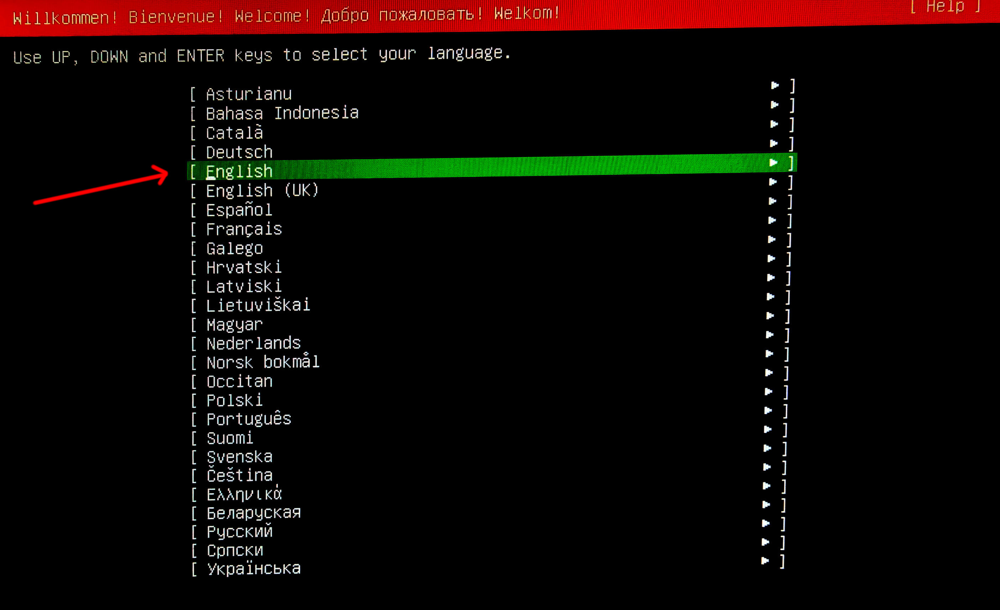

2. Select `English (US)` keyboard layout and variant.

   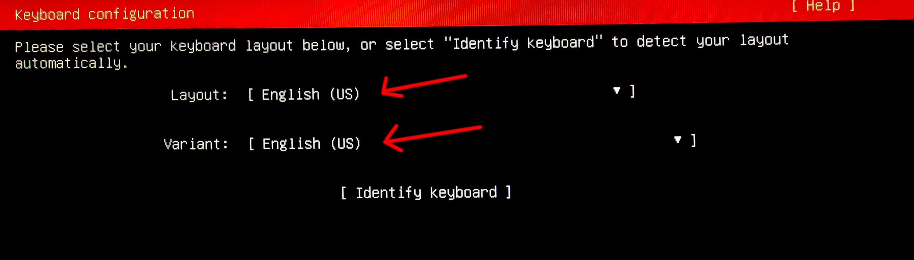

3. Select `Ubuntu Server (minimized)` and enable third-party driver search if available.

   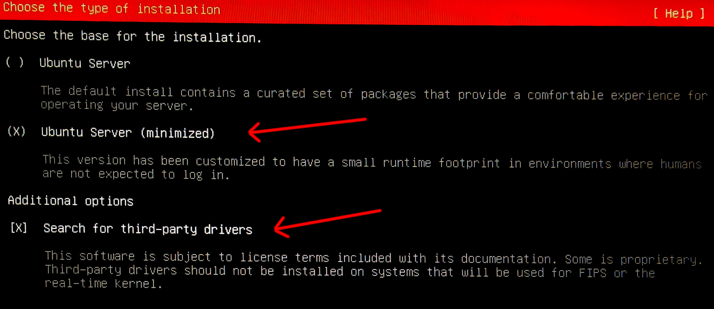

4. Leave network on **DHCP** (the install script reconfigures it later).

   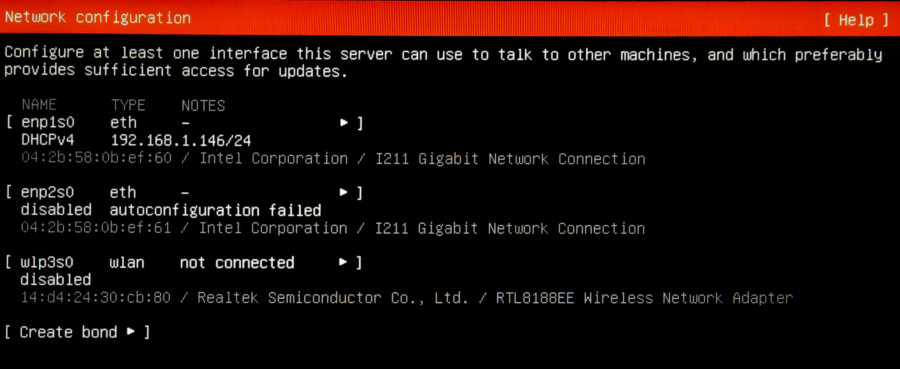

5. Skip HTTP proxy.

   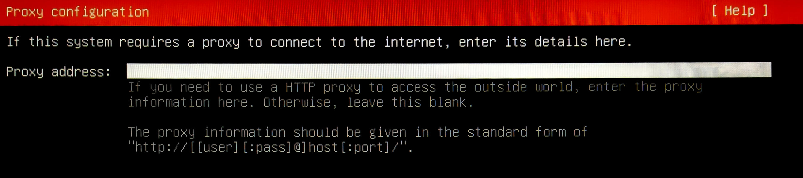

6. Keep the **default** APT mirror.

   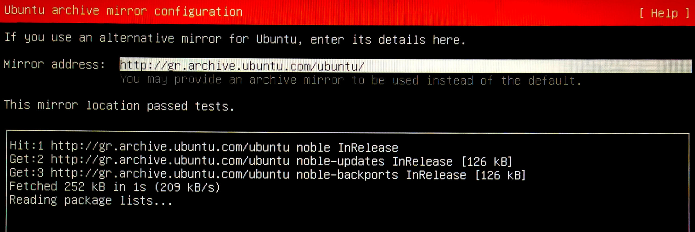

7. Uncheck `Set up this disk as an LVM group`. Ensure `Use an entire disk` is selected.

   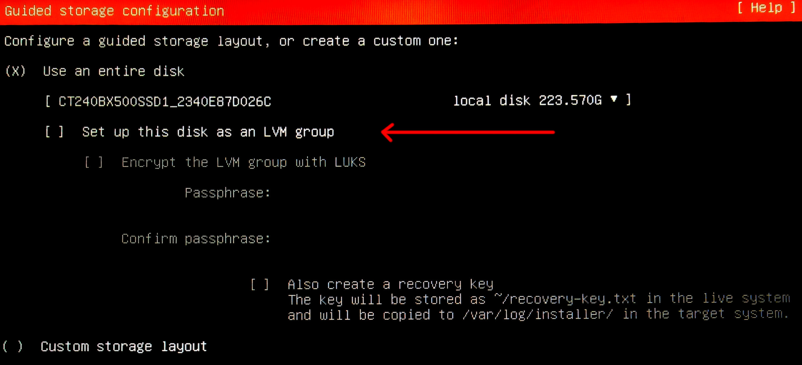

8. Continue with defaults.

   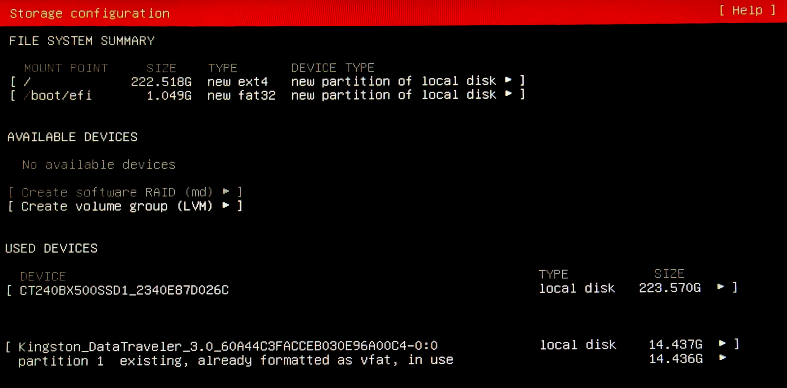

9. Create user `coolblock`, set hostname to `panel`, password to `coolblock` (changed later by end customer).

   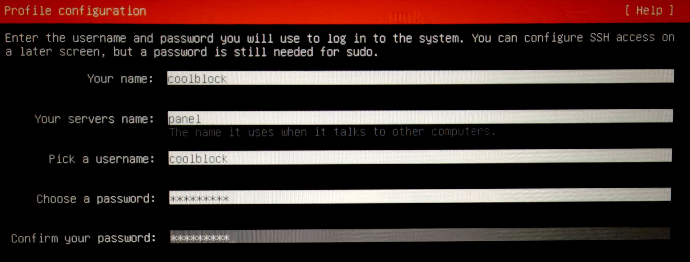

10. Skip `Ubuntu Pro`.

    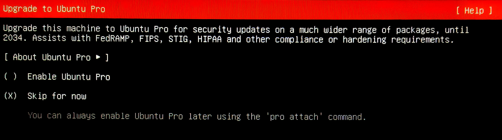

11. Select `Install OpenSSH server`.

    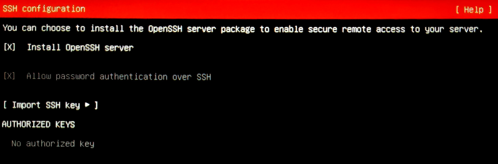

12. Do **not** select any additional snap packages.

    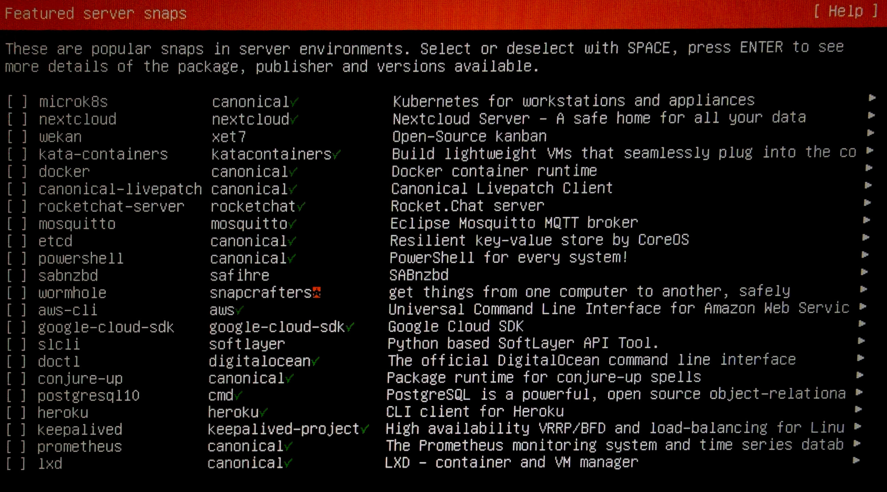

13. Reboot when installation completes.

    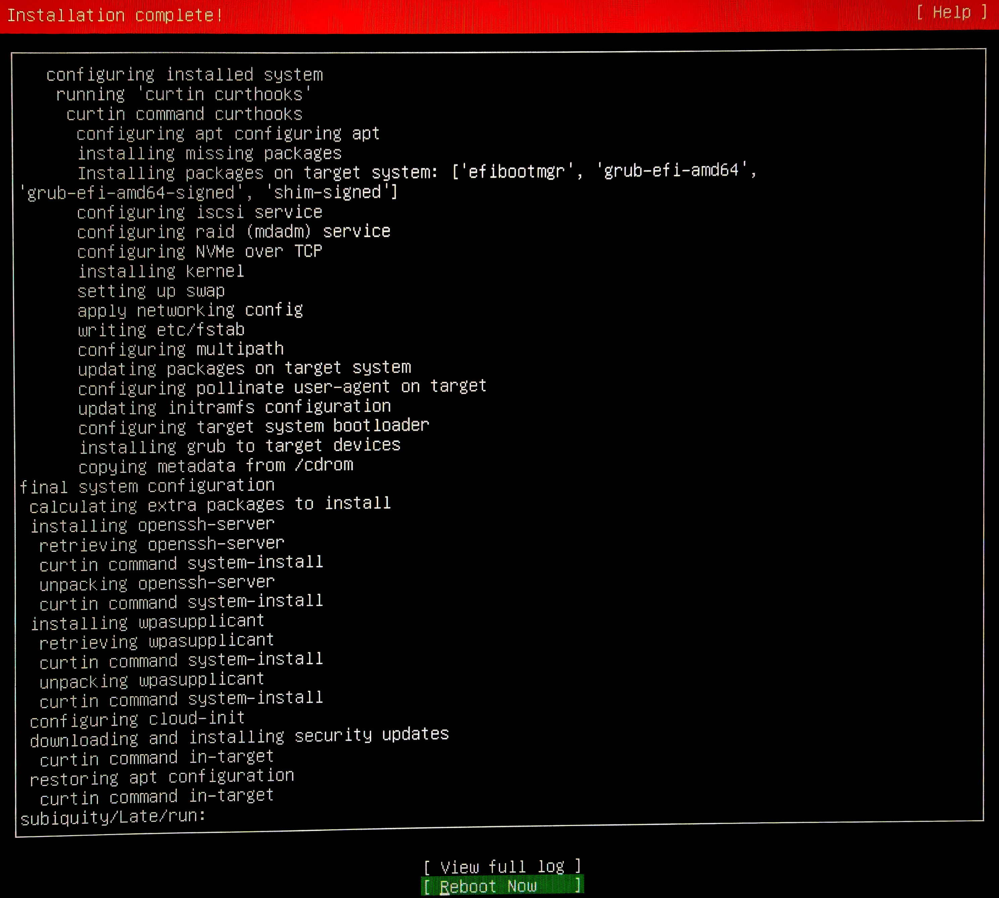
